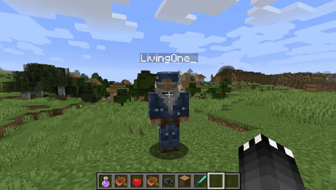
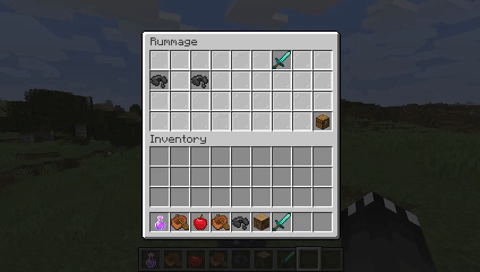
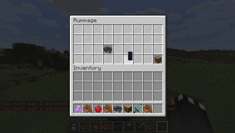
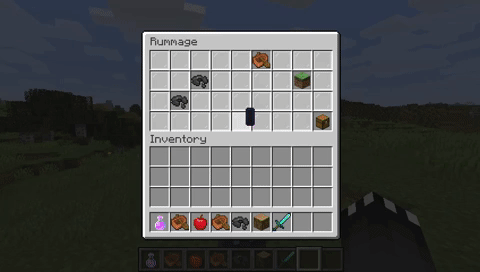

This plugin provides another way of stealing from other players, via pick-pocketing.

#### How to pick-pocket
To initiate pick-pocketing, simply crouch and right-click another player.

Upon clicking the player you will be presented with the "Rummage" GUI.
In this GUI you can look through the inventory contents of the player you're
looking at.

While rummaging through a players inventory there is a 10% chance that
will get caught, and the rummage inventory will close, alerting you and
the person you're pick-pocketing.

Once you have chose then item you would like to pick-pocket, click on it
and an inventory mini-game will start.

During this mini-game the item you have chosen to steal will move to a random
slot in the inventory every second. You must click the item before the second expires
otherwise that will count as a miss. If you miss more than twice, or click the item
less than 3 times, the mini-game inventory will close and you will receive a message
saying "Theft unsuccessful".

However, if you win this mini-game by clicking on the item a minimum of 3 out
of 5 times, then you will receive a message saying "Theft successful", and the item
you stole will get added to your inventory.

#### Disabling pick-pocketing for yourself
You can choose to opt out of pick-pocketing by using the command '/pickpocket toggle'.
This command will prevent you from being pick-pocketed and will also prevent you
from pick-pocketing.

|Command|Permission|Description|
|-------|----------|-----------|
|/pickpocket use|pickpocket.use|Allow usage of the plugin. Without this permission a player cannot pick-pocket.|
|/pickpocket admin|pickpocket.admin|Receive admin notifications when a player has stolen from another player. (may be broken)|
|/pickpocket exempt [name]|pickpocket.exempt|Exempt yourself or another player from pick-pocketing.|
|/pickpocket bypass [name]|pickpocket.bypass|Toggle cooldown bypass for yourself or another player.|
|/pickpocket toggle|pickpocket.toggle|Toggle pick-pocketing for yourself.|
|/pickpocket reload|pickpocket.reload|Reload the configuration file.|

#### Discord
https://discord.gg/wBc8T7A

#### GitHub Repository (Always most recent)
https://github.com/escape9179/pickpocket
